<h1 align="center">Redi ☁️</h1>

<p align="center">
  <b>A private, self-hosted college companion for staying organized and on track.</b>
  <br />
  Degree planning · registration tracking · deadline reminders · college-email triage · AI chat · MCP access
</p>

<p align="center">
  <a href="https://github.com/visorcraft/college-redi/actions/workflows/ci.yml"></a>
  
  
  
  
  
</p>

---

## Quick Start

### Docker

```bash
git clone https://github.com/visorcraft/college-redi.git
cd college-redi
install -d -m 700 redi-data
docker compose up -d --build
```

### Podman

```bash
git clone https://github.com/visorcraft/college-redi.git
cd college-redi
install -d -m 700 redi-data
podman compose up -d --build
```

The locally built all-in-one image uses embedded MongrelDB and publishes Redi
only on `127.0.0.1:3000`. The included
`docker-compose.yml` also works with `podman-compose`. Open
http://localhost:3000 and finish the first-run wizard.

### Local development

```bash
cp .env.example .env
npm install
npm run dev
```

Open http://localhost:3000 and finish the first-run wizard.

### Daemon mode

```bash
DATA_DIR=./redi-data ./scripts/bootstrap-env.sh
set -a; . ./redi-data/.env; set +a
docker compose -f docker-compose.daemon.yml up -d
```

`mongreldb-server` binds loopback only, so plain `-p 8453:8453` mapping cannot reach it. The compose file uses host networking and documents an advanced `socat` bridge-network variant. Run exactly one MongrelDB process per data directory.

## Built with Codex & GPT-5.6

I built Redi with the Codex CLI harness as my day-to-day development workspace: I used it to explore the codebase, implement features, run the app and its tests, trace failures, and exercise real setup and chat flows in a browser. `gpt-5.6-sol` on `high` effort was my go-to model, especially for working through the messier parts like normalizing degree audits and college emails, designing the security model, and debugging multi-turn chat with tool calls. I still drove the product decisions and tested the results, but that tight edit-run-review loop made it practical to turn Redi into a private, self-hosted app instead of leaving it as an idea.

## Gallery

Every screenshot was captured at 1500 × 1000 pixels (3:2). Click any thumbnail for the full-size image.

<table>
  <tr>
    <td width="33.33%" align="center"><a href="docs/screenshots/01-wizard-welcome.png">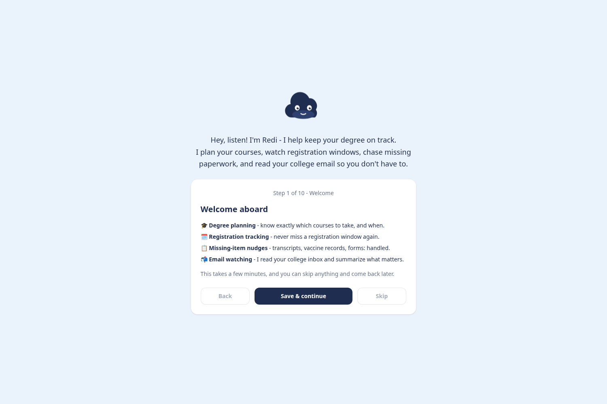<br /><sub><b>Welcome</b></sub></a></td>
    <td width="33.33%" align="center"><a href="docs/screenshots/02-wizard-login.png">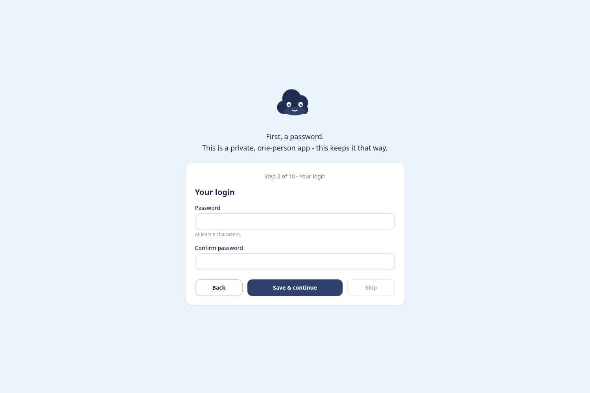<br /><sub><b>Your login</b></sub></a></td>
    <td width="33.33%" align="center"><a href="docs/screenshots/03-wizard-ai.png">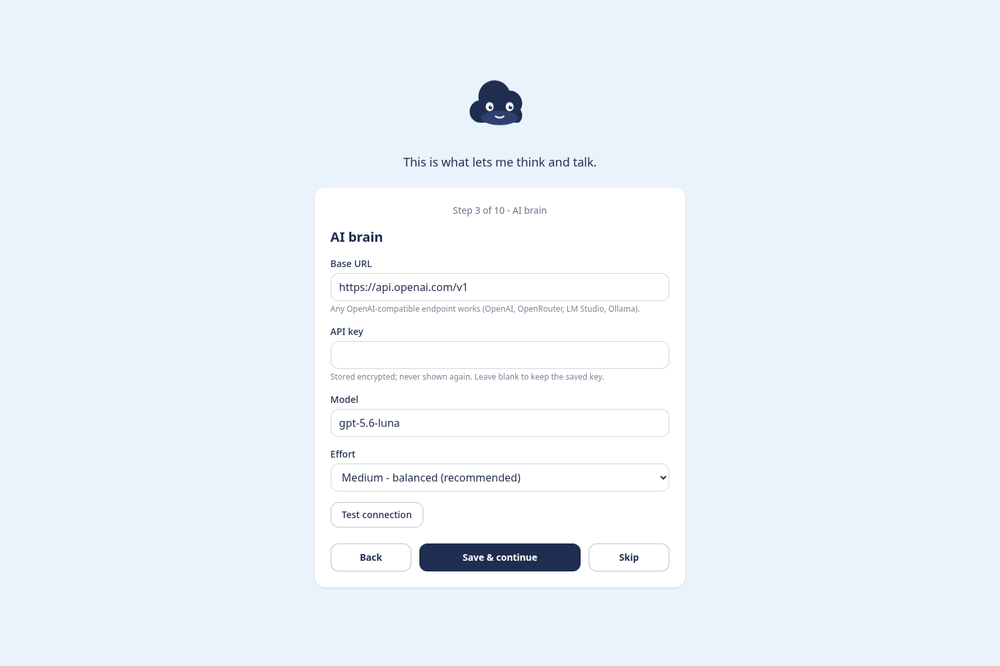<br /><sub><b>AI brain</b></sub></a></td>
  </tr>
  <tr>
    <td width="33.33%" align="center"><a href="docs/screenshots/04-wizard-college-email.png">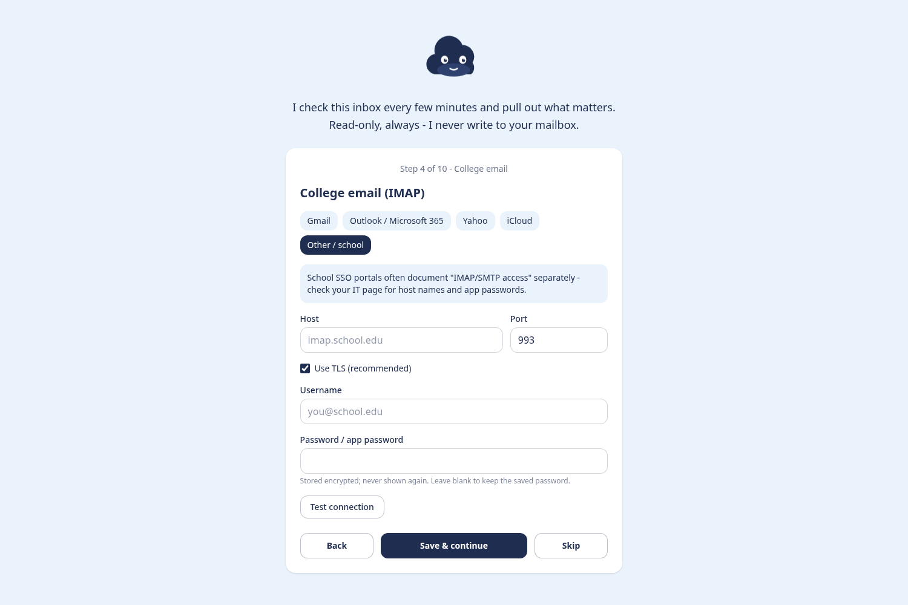<br /><sub><b>College email</b></sub></a></td>
    <td width="33.33%" align="center"><a href="docs/screenshots/05-wizard-personal-email.png">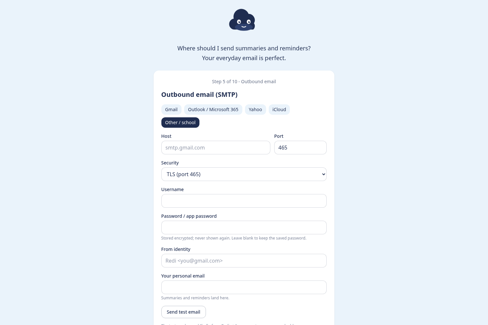<br /><sub><b>Personal email</b></sub></a></td>
    <td width="33.33%" align="center"><a href="docs/screenshots/06-wizard-text-messages.png">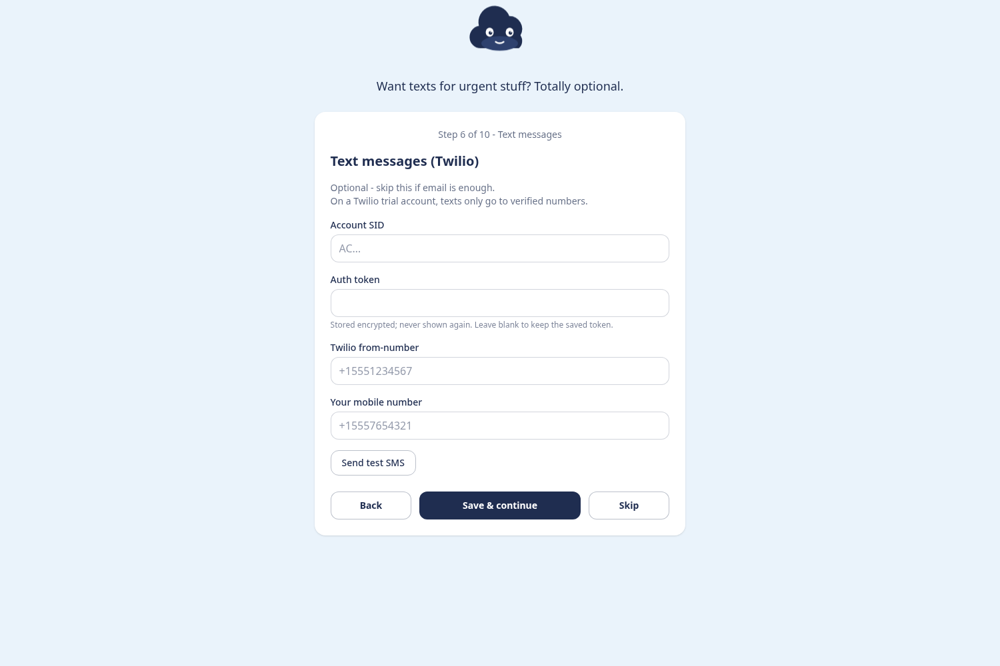<br /><sub><b>Text messages</b></sub></a></td>
  </tr>
  <tr>
    <td width="33.33%" align="center"><a href="docs/screenshots/07-wizard-degree.png">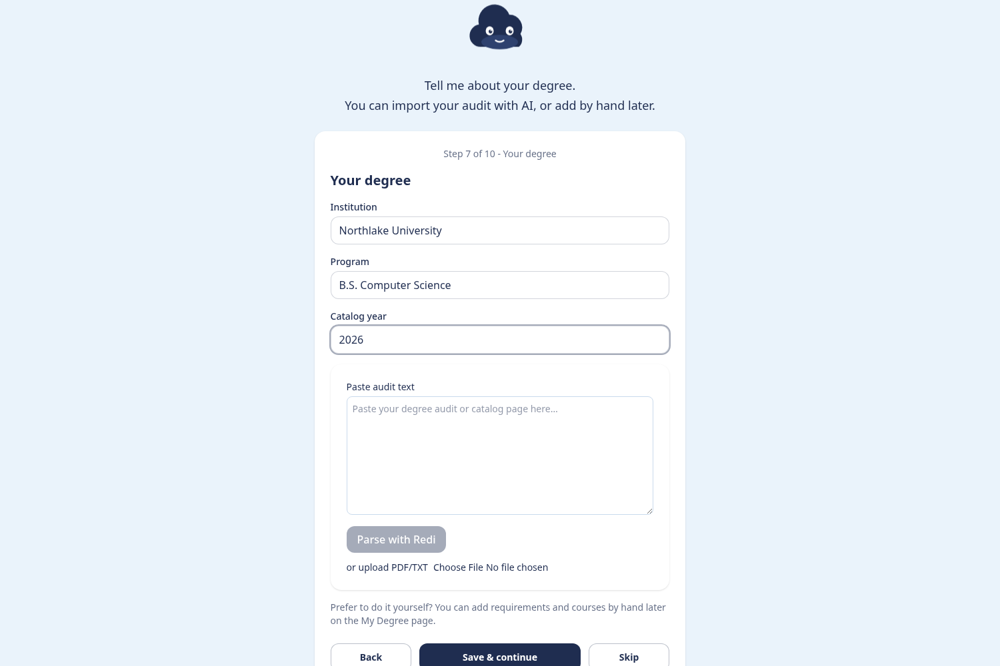<br /><sub><b>Your degree</b></sub></a></td>
    <td width="33.33%" align="center"><a href="docs/screenshots/08-wizard-checklist.png">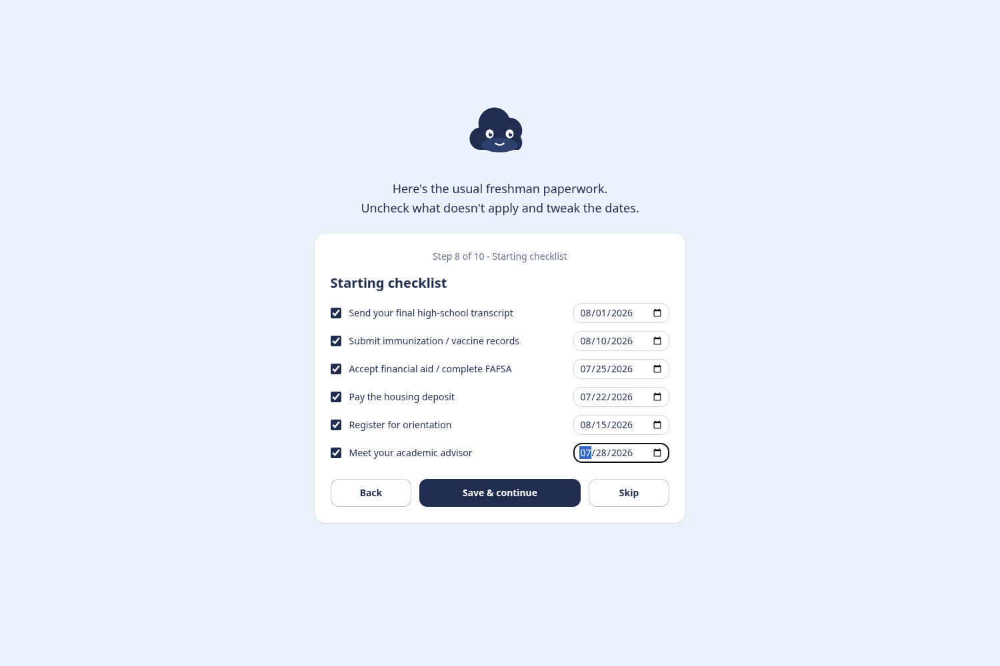<br /><sub><b>Starting checklist</b></sub></a></td>
    <td width="33.33%" align="center"><a href="docs/screenshots/09-wizard-notifications.png">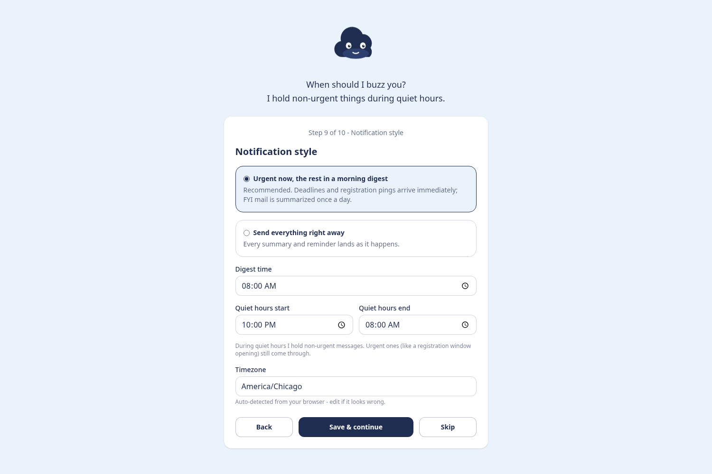<br /><sub><b>Notification style</b></sub></a></td>
  </tr>
  <tr>
    <td width="33.33%" align="center"><a href="docs/screenshots/10-wizard-done.png">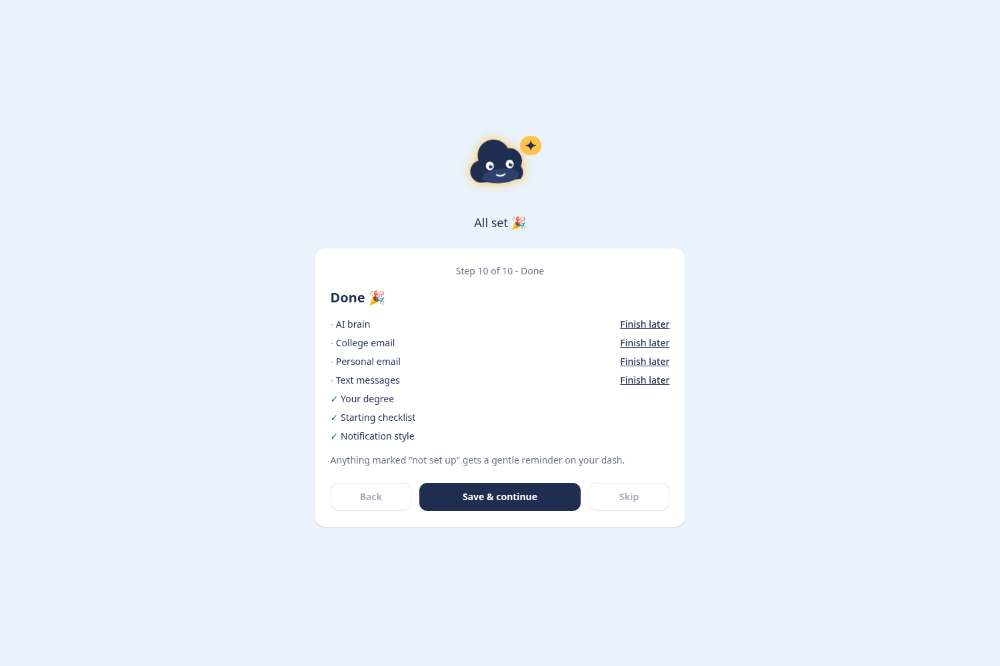<br /><sub><b>Setup complete</b></sub></a></td>
    <td width="33.33%" align="center"><a href="docs/screenshots/11-app-dashboard.png">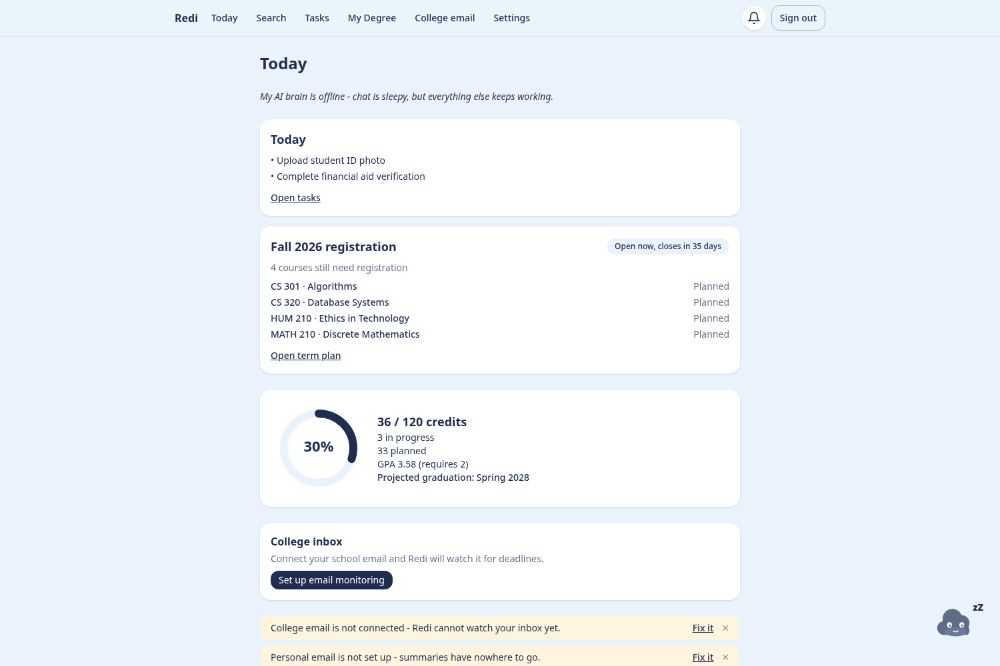<br /><sub><b>Today dashboard</b></sub></a></td>
    <td width="33.33%" align="center"><a href="docs/screenshots/12-app-tasks.png">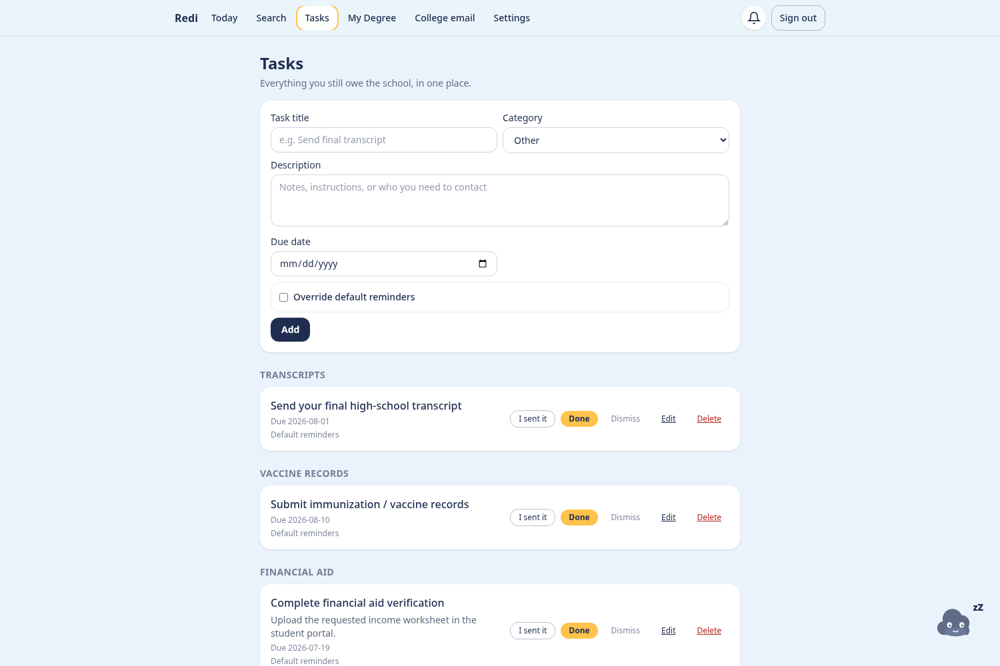<br /><sub><b>Tasks</b></sub></a></td>
  </tr>
  <tr>
    <td width="33.33%" align="center"><a href="docs/screenshots/13-app-degree.png">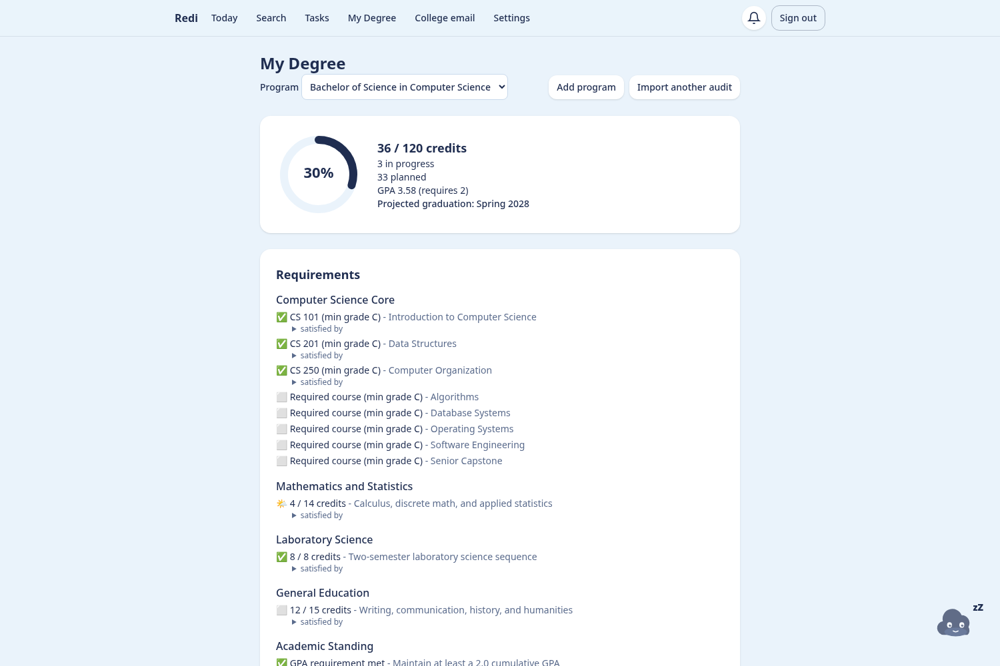<br /><sub><b>My Degree</b></sub></a></td>
    <td width="33.33%" align="center"><a href="docs/screenshots/14-app-search.png">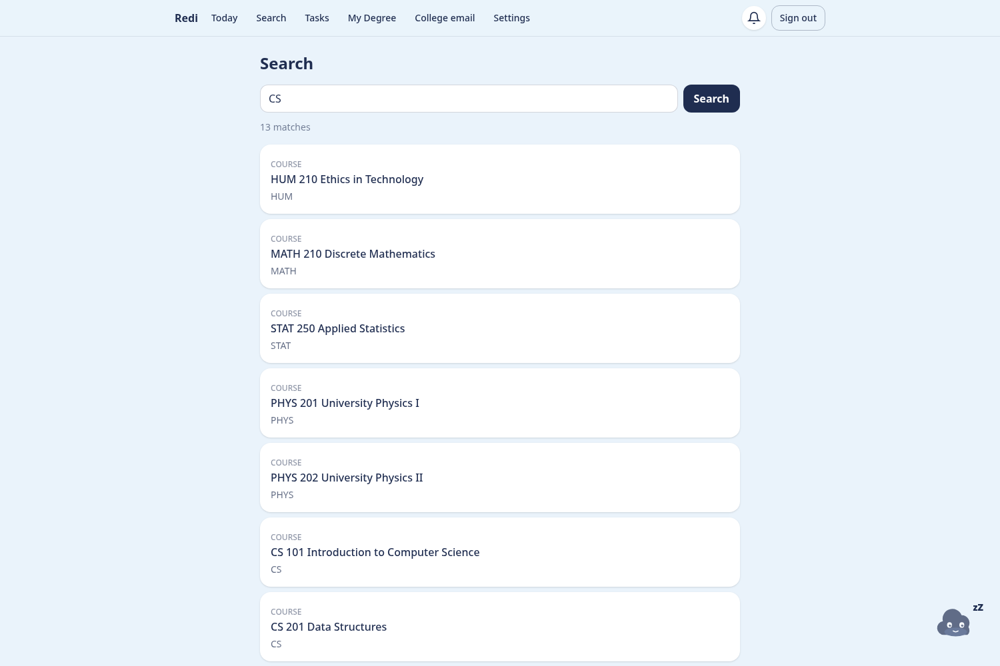<br /><sub><b>Search</b></sub></a></td>
    <td width="33.33%" align="center"><a href="docs/screenshots/15-app-settings.png">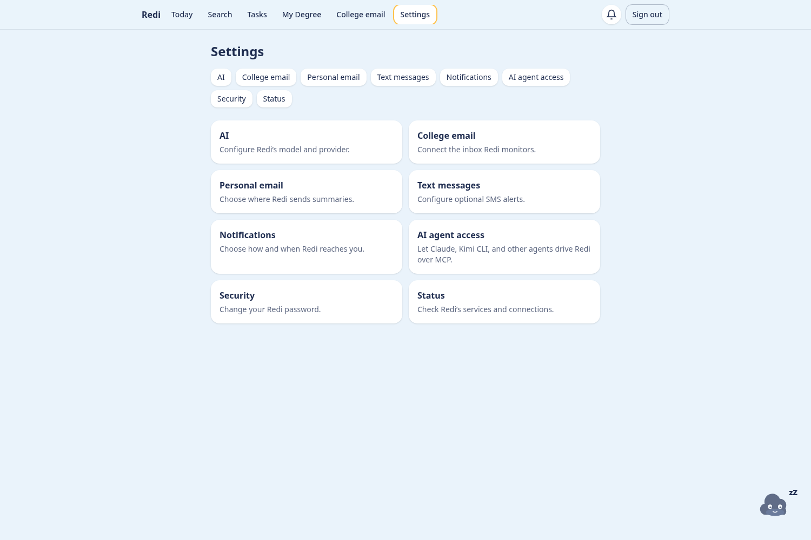<br /><sub><b>Settings</b></sub></a></td>
  </tr>
</table>

## What is Redi?

Redi is a single-user, self-hosted web app that helps one college student get through their degree without dropping administrative balls. It does four things:

1. **Degree planning**: models your program's requirements, tracks completed courses and per-term plans, computes progress and projected graduation.
2. **Registration tracking**: reminds you when registration windows open and tracks each planned course from `planned → registered | waitlisted | dropped`.
3. **Missing-item reminders**: administrative checklist with due dates and reminders until confirmed done.
4. **College-email monitoring**: polls school email through read-only IMAP, uses AI to triage it, extracts deadlines into tasks, and sends plain-language summaries.

Redi is also the floating navy-blue cloud who leads setup and chats with full access to every system capability.

Every capability is implemented once as a typed tool and exposed through REST, Redi chat, and MCP Streamable HTTP at `/mcp`.

Read the story behind the project in [about.md](about.md).

## First-boot credentials and encryption

MongrelDB always uses AES-256-GCM encryption at rest and storage-level credential enforcement. Before startup, `scripts/bootstrap-env.sh` checks `$DATA_DIR/.env`:

- If absent, it creates `MONGRELDB_DB_USERNAME`, random 32-byte database credentials, and a one-time `REDI_SETUP_TOKEN`, then sets file mode `0600`. Values are never logged.
- If present, it loads the file without overwriting it.

> **Back up `.env` and `master.key`.** Without them, encrypted data is permanently unrecoverable.

## Configuration

Settings and the wizard handle normal configuration. Environment variables may pre-seed it. Full reference:

| var | default | purpose |
|---|---|---|
| `PORT` | `3000` | App HTTP port |
| `DATA_DIR` | `./data` (`/data` in image) | Root of all state |
| `DATABASE_MODE` | `embedded` | `embedded` \| `remote` |
| `MONGRELDB_PATH` | `$DATA_DIR/db` | Embedded data directory |
| `MONGRELDB_URL` | `http://127.0.0.1:8453` | Daemon URL (remote mode) |
| `MONGRELDB_DB_USERNAME` | `redi` | DB catalog user; auto-generated into `$DATA_DIR/.env` on first boot (§4.6); env overrides file |
| `MONGRELDB_DB_PASSWORD` | *(generated)* | DB user password; 32-byte random, auto-generated into `.env` (§4.6) |
| `MONGRELDB_PASSPHRASE` | *(generated)* | At-rest encryption passphrase; 32-byte random, auto-generated into `.env` (§4.6) |
| `REDI_MASTER_KEY` | - (else keyfile) | 32-byte secret-encryption key |
| `REDI_SETUP_TOKEN` | *(generated)* | One-time token required to claim a fresh installation |
| `SESSION_SECRET` | - (else derived from master key) | Cookie HMAC key |
| `TRUST_PROXY_HOPS` | `0` | Number of reverse proxies trusted to append `X-Forwarded-For` |
| `SCHEDULER_ENABLED` | `true` | In-process scheduler on/off |
| `CRON_SECRET` | - (generatable in UI) | `POST /api/cron/tick` shared secret |
| `LOG_LEVEL` | `info` | |
| `TZ` | auto-detected in wizard | Default timezone fallback |

## MCP

In Settings, open **AI agent access**, then create a named token. It is shown once and stored only as an Argon2id hash.

```json
{
  "mcpServers": {
    "redi": {
      "command": "npx",
      "args": [
        "mcp-remote",
        "https://your-redi-host:3000/mcp",
        "--header",
        "Authorization: Bearer PASTE_TOKEN_HERE"
      ]
    }
  }
}
```

MCP clients receive the complete tool catalog and four read-only resources:

- `redi://degree/progress`
- `redi://tasks/open`
- `redi://notifications/recent`
- `redi://emails/recent-summaries`

Every call is audited under `mcp:<token-name>`. Token revocation is immediate.

## Backup and restore

Embedded mode keeps all state under `/data`: `db/`, `.env`, `master.key`, and optional `logs/`.

- Backup: stop Redi, copy the whole directory, then restart.
- Restore: stop Redi, replace the whole directory, then restart.
- Daemon mode: back up `./redi-data/db`, `./redi-data/.env`, and `./redi-data/app`.

There is no in-app backup machinery in v1.

## Security

- Password and MCP token hashes use Argon2id. Sessions use HMAC-signed, httpOnly, `SameSite=Lax` cookies.
- Mutating APIs enforce double-submit CSRF. Login locks each client for five minutes after five failures.
- Application secrets use AES-256-GCM before database storage.
- IMAP access is read-only. Raw email bodies are discarded after processing.
- Logs omit secrets, email bodies, chat bodies, and AI prompt bodies.
- For access beyond localhost, proxy `127.0.0.1:3000` through Tailscale or TLS and set `TRUST_PROXY_HOPS` to the exact proxy count. Never expose MongrelDB port `8453`.

## Version pins

| artifact | pin |
|---|---|
| MongrelDB engine/server | `v0.60.3` |
| `@visorcraft/mongreldb` | `0.60.3` |
| `@visorcraft/mongreldb-kit` | `0.60.3` |
| `ghcr.io/visorcraft/mongreldb-server` | `v0.60.3` |

## Development

```bash
npm run dev
npx vitest run tests/unit/<file>
npx vitest run -c vitest.integration.config.ts tests/integration/<file>
npx playwright test
```

Production checklist: [docs/deployment-checklist.md](docs/deployment-checklist.md).

## Contributing

Contributions are welcome. See [CONTRIBUTING.md](CONTRIBUTING.md) for the development workflow and pull request guidelines.

## Security

Please report vulnerabilities privately. See [SECURITY.md](SECURITY.md) for supported versions and reporting instructions.

## License

Redi is licensed under the [GNU General Public License v3.0 only](LICENSE).
